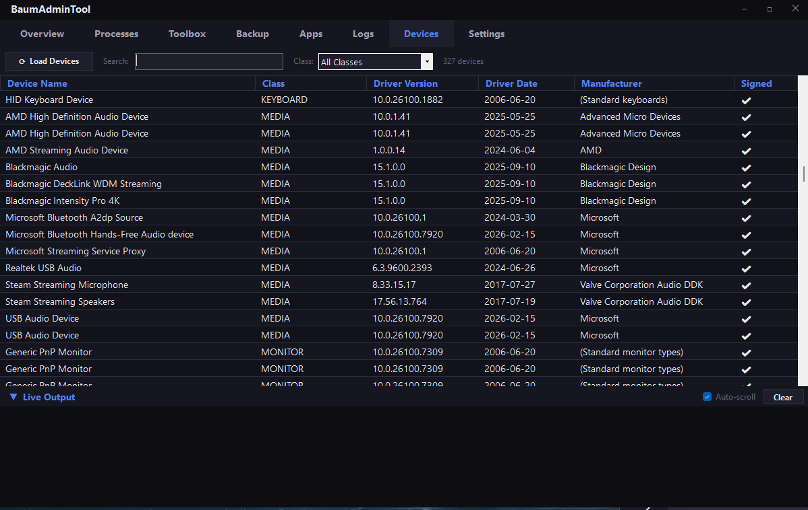

# BaumAdminTool

A portable dark-theme Windows administrative utility for system administrators. Provides a fast, centralized way to inspect, troubleshoot, and maintain a Windows system — no installation required to run.

Built as part of the [BAUM GitHub architecture](https://github.com/Bruiserbaum) alongside BaumLaunch, BaumDash, and BaumSecure.



---

## Features

### Overview
Displays a live snapshot of the system at a glance:
- **Machine** — hostname, logged-in user, OS version, build number, uptime
- **CPU & Memory** — processor name, core count, current CPU load %, RAM used/total with usage bar
- **Disk** — per-drive capacity, free space, usage bar, and BitLocker encryption status
- **Network** — adapter name, IP address, subnet, gateway, DNS servers, MAC address
- **GPU** — discrete GPU name via CIM (filters out Microsoft Basic Display Adapter)

### Processes
Live process monitor showing the top 40 processes sorted by CPU % then memory.
- Auto-refreshes every 3 seconds (toggle on/off)
- CPU % calculated via `TotalProcessorTime` delta sampling
- High-CPU rows highlighted in orange

### Toolbox
One-click admin actions organized by category. All output streams live to the **Live Output** panel at the bottom.

| Category | Actions |
|---|---|
| **Network** | Flush DNS, Reset Winsock, Reset TCP/IP, Release/Renew IP, Ping 8.8.8.8, Restart WLAN |
| **System Repair** | SFC Scan, DISM Repair, Clear Temp Files, Empty Recycle Bin, Check C: Disk |
| **Windows** | GPUpdate, Restart Explorer, Restart Print Spooler |
| **Registry** | Clear Recent Files, Clear Run MRU |

### Backup
RoboCopy-based backup of standard user folders to any destination.
- Checkboxes for Desktop, Documents, Downloads, Pictures, Music, Videos
- Optional **Mirror mode** (`/MIR`) — deletes destination files not in source
- Per-folder progress streamed to Live Output

### Apps
Full list of installed applications read directly from the Windows registry (HKLM 64-bit, HKLM 32-bit, HKCU).
- Columns: Application Name, Version, Publisher, Install Date
- Live search filters by name or publisher

### Logs
Windows Event Log viewer for System and Application logs (last 30 days).
- Filter by **level**: Critical + Error (default), Critical Only, Error Only, Warning, All
- Filter by **log source**: All, System, Application, Security
- Filter by **Event ID**: type one or more IDs comma-separated (e.g. `41, 6008`)
- Click any row to see the full event message in the detail pane

### Devices
Full list of installed PnP devices and their driver information via `Win32_PnPSignedDriver` CIM.
- Columns: Device Name, Class, Driver Version, Driver Date, Manufacturer, Signed
- Unsigned drivers highlighted in orange
- Filter by **device class** (dropdown auto-populated: Display, Net, USB, etc.)
- Search by device name or manufacturer
- Loads on demand — click **Load Devices** (enumeration takes a few seconds)

### Settings
- **Check for Updates** — fetches latest release from GitHub, downloads installer, runs silently, and relaunches the app
- **Version** — displays the currently installed version

---

## Requirements
- Windows 10 22H2 or later (Windows 11 recommended)
- x64 system
- No .NET runtime required — self-contained executable

## No External Dependencies
Built entirely on .NET 8 built-in APIs:
- `System.Net.NetworkInformation` — network adapter info
- `System.Diagnostics.Eventing.Reader` — event log queries
- `System.Diagnostics.Process` — process monitoring and admin action execution
- `Microsoft.Win32.Registry` — installed apps
- `kernel32.dll GlobalMemoryStatusEx` P/Invoke — RAM stats
- `uxtheme.dll SetWindowTheme` P/Invoke — dark scrollbars

## Build
```
cd BaumAdminTool
dotnet publish -c Release -r win-x64 --self-contained true
```
Installer (requires [Inno Setup 6](https://jrsoftware.org/isinfo.php)):
```
"C:\Program Files (x86)\Inno Setup 6\ISCC.exe" installer\setup.iss
```

---

## License and Project Status

This repository is a personal project shared publicly for learning, reference, portfolio, and experimentation purposes.

Development may include AI-assisted ideation, drafting, refactoring, or code generation. All code and content published here were reviewed, selected, and curated before release.

This project is licensed under the Apache License 2.0. See the LICENSE file for details.

Unless explicitly stated otherwise, this repository is provided as-is, without warranty, support obligation, or guarantee of suitability for production use.

Any third-party libraries, assets, icons, fonts, models, or dependencies used by this project remain subject to their own licenses and terms.